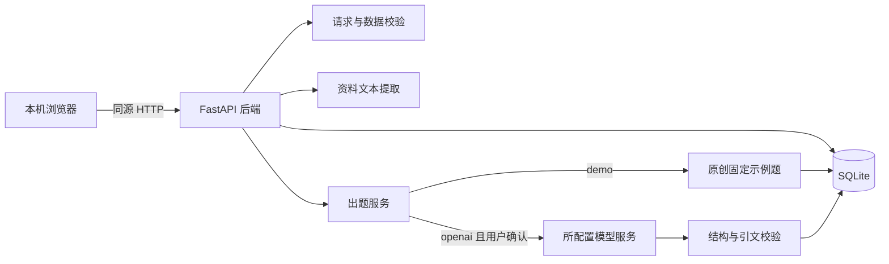
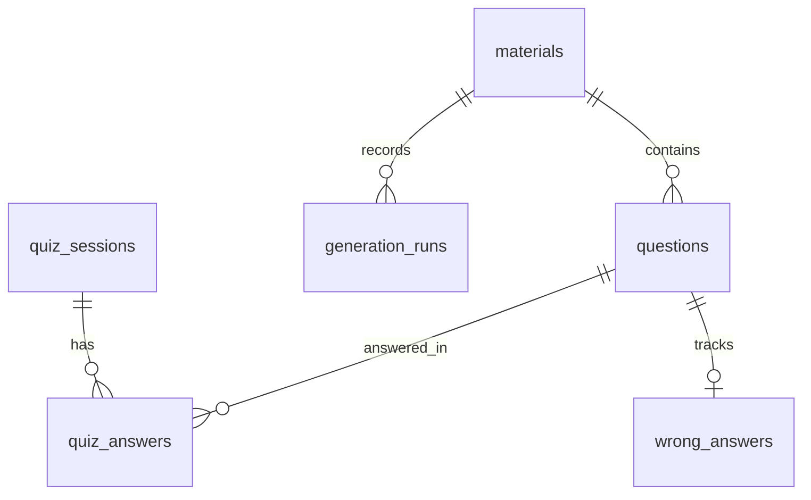
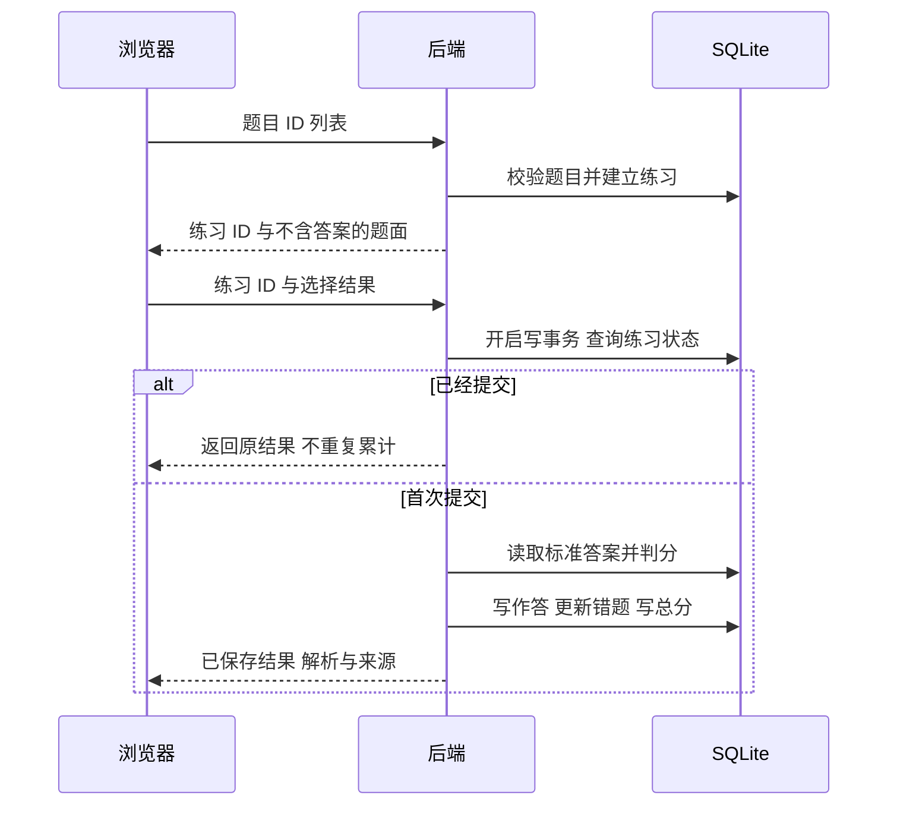

# 架构 数据库与接口说明

本文按仓库实际实现解释设计，主要对应 `app/config.py`、`database.py`、`schemas.py`、`materials.py`、`generation.py`、`demo.py` 和 `main.py`。接口完整机器可读定义由运行中的 `/openapi.json` 提供。改变代码后，需要同步更新本文。

## 1 总体架构



浏览器只访问本机后端。真实模式下，后端将生成指令和所选资料全文发送至 `LLM_BASE_URL` 指定的 HTTPS 服务。浏览器不直接携带模型 API 密钥请求外部模型。

本版没有向量数据库、Embedding、模型训练、自动资料检索或分块检索。资料长度上限为 30,000 字符，这不等于 30,000 token，也不保证适合任意模型的上下文窗口。

## 2 文件职责

| 文件或目录 | 职责 | 学习时重点看什么 |
| --- | --- | --- |
| `app/config.py` | 环境变量、本地 .env 和配置验证 | 密钥边界、默认模式、数据库路径 |
| `app/database.py` | 建表、连接、外键与事务 | 六张表关系，写事务的回滚 |
| `app/schemas.py` | 请求、题目与导入文件模型 | 必填字段、范围和额外字段拒绝 |
| `app/materials.py` | TXT/Markdown/PDF 文字提取 | 大小、页数、编码和空文本检查 |
| `app/demo.py` | 原创 Python 材料与固定示例题 | 为什么演示不能当真实生成实验 |
| `app/generation.py` | 提示词、兼容 API 调用、结果验证 | JSON 结构、题数、引文与失败处理 |
| `app/main.py` | 路由与业务流程 | 生成存库、练习判分、错题和统计 |
| `app/templates/index.html` | 页面骨架 | 导航、表单、对话框、可访问性标签 |
| `app/static/app.js` | 浏览器交互 | fetch、状态、错误、重复点击防护 |
| `app/static/style.css` | 视觉与响应式布局 | 页面适配与状态样式 |
| `tests/` | 自动化测试 | 正常、边界、失败及模拟模型响应 |

Python 内置 `sqlite3` 直接操作数据库，没有额外 ORM。真实模型适配使用 HTTP 请求，不依赖一个特定模型 SDK。

## 3 配置合同

| 环境变量 | 默认值 | 说明 |
| --- | --- | --- |
| `API_MODE` | `demo` | `demo` 禁用真实调用；`openai` 允许通过界面显式请求真实生成 |
| `DATABASE_PATH` | `data/app.db` | 相对路径按项目根目录解析 |
| `LLM_API_KEY` | 空 | 仅后端使用，缺失时真实生成不可用 |
| `LLM_BASE_URL` | `https://api.deepseek.com` | 必须是无账号密码、查询串和片段的 HTTPS 基础地址 |
| `LLM_MODEL` | `deepseek-flash` | 按服务商账户当前支持的模型配置 |
| `LLM_TIMEOUT_SECONDS` | `60` | 允许 1–180，网络超时配置，不是严格端到端耗时承诺 |

启动会读取根目录 `.env`，已有进程环境变量优先。修改 `.env` 或终端配置后重启服务。`.env.example` 是可公开示例，`.env` 含真实值时属于本机私有文件。

适配器向“基础地址 + `/chat/completions`”发 POST。因此不要在基础地址中再填写 `/chat/completions`。有些提供方的基础地址含 `/v1`，有些不需要，应按官方说明填写。DeepSeek 示例依据见 [参考资料](10-references.md)。

## 4 数据库关系



`quiz_sessions.question_ids` 以 JSON 保存有序题目 ID 列表；它是应用维护的引用，不是 SQLite 自动校验的外键。`quiz_answers` 的联合主键保证同一练习的同一题只有一条作答记录。

### 4.1 materials 资料表

| 字段 | 类型与约束 | 含义 |
| --- | --- | --- |
| id | INTEGER 主键 | 资料标识 |
| title / course | TEXT 非空 | 标题与课程 |
| filename | TEXT 非空，默认空 | 上传时的显示文件名，不用它决定服务器保存路径 |
| text | TEXT 非空 | 提取或粘贴的资料正文 |
| content_hash | TEXT 非空 | 文本 SHA-256，用于识别相同内容 |
| created_at | TEXT 非空 | 创建时间，应用使用 UTC ISO 格式 |

去重规则是正文哈希、标题和课程都一致时复用已有资料。它不做相似语义去重。

### 4.2 questions 题目表

| 字段 | 类型与约束 | 含义 |
| --- | --- | --- |
| id | INTEGER 主键 | 题目标识 |
| material_id | INTEGER 外键 | 所属资料 |
| stem | TEXT | 题干 |
| options | TEXT | 四个选项的 JSON 数组 |
| answer | INTEGER，0–3 | 正确选项索引，0=A、1=B、2=C、3=D |
| explanation / source_quote | TEXT | 解析、连续逐字原文引文 |
| knowledge_point | TEXT | 知识点标签，由示例或模型提供，未做标准知识体系归一化 |
| difficulty | TEXT | easy、medium 或 hard |
| generator | TEXT | demo-curated、openai-compatible 或 imported 等来源标记 |
| fingerprint | TEXT 唯一 | 资料 ID 与题目全部字段形成的指纹，用于精确去重 |
| created_at | TEXT | 创建时间 |

不同表达但相同含义的题仍可能重复；当前只实现指定规则下的精确去重。难度是生成请求/输出标签，没有通过真实学习者测量校准。

### 4.3 quiz_sessions 练习表

`id` 是主键；`question_ids` 保存题目顺序；`mode` 为 normal 或 wrongbook；`created_at`、`submitted_at` 分别表示开始和完成时间；`score` 为百分制分数；`correct`、`total` 记录答对数和题数。未提交时部分结果字段为空，统计和历史只计入已提交练习。

### 4.4 quiz_answers 作答表

联合主键为 `(quiz_id, question_id)`，分别关联练习和题目。`selected` 是 0–3，未作答为 NULL；`is_correct` 是数据库中的 0/1。页面提交未答题时按错误处理，因此需要在提交确认中提醒用户。

### 4.5 wrong_answers 错题表

每个题目只有一条错题记录，`question_id` 同时为主键与外键。`wrong_count` 记录累计答错次数，`last_wrong_at` 为最近答错时间，`last_selected` 可为空，`mastered` 为是否已掌握。

答错或漏答会新增/累计错题并设为未掌握。之后在任何练习中答对已有错题，会将它标为已掌握；也支持手动修改。再次答错会恢复未掌握。历史答错次数不会因为标记掌握而归零。这只是本系统复习规则，不是经过认知研究验证的记忆模型。

### 4.6 generation_runs 生成记录表

记录 `material_id`、`mode`、`requested_count`、`status` 和 `created_at`。成功生成、以及进入模型调用后发生的生成失败会被记录。缺失密钥、未确认外发、资料不存在等前置拒绝不是全部都写入此表。

本表不保存模型版本、完整提示词、原始响应、token、耗时或费用。因此不能仅凭该表完成质量与成本实验；需要按照 [实验方案](06-testing-and-experiments.md) 另外保留脱敏记录。

## 5 关键数据流程

### 5.1 导入资料

表单校验 → 限制请求/文件大小 → 按扩展名选择提取 → 检查 UTF-8、页数和有效文字 → 统一文本 → 检查标题课程与长度 → 去重查询 → 事务存库。

TXT 和 Markdown 支持 UTF-8/UTF-8 BOM；不是 GBK 自动识别器。PDF 只提取已有文字，不执行 OCR。文件最大 5 MiB，PDF 最多 40 页，正文为 20–30,000 字符；加密、损坏和无足够文字的文件拒绝。页面通常写 5 MB，底层阈值为 5 × 1024 × 1024 字节。

PDF 在有时限的独立进程内解析，Linux 另设进程资源限制。这是降低风险的措施，不是生产级恶意文件安全保证；Windows 未等价验证所有资源限制。本机原型不应作为任意陌生人上传文件的公网服务。

### 5.2 真实生成

1. 查询所选资料。
2. 确认服务已启用且有密钥。
3. 确认本次 `confirm_send=true`，即用户明确同意资料外发及可能费用。
4. 获取进程内生成锁，避免同一进程同时发起重复计费请求。
5. 将系统生成规则与资料全文以 JSON 字符串作为消息发送；资料被标为不可信内容。
6. 请求 `response_format={"type":"json_object"}`、`temperature=0.3`，输出 token 上限按题数计算。
7. 检查服务 HTTP 状态、响应大小、结束原因和 JSON/题目字段。
8. 检查题数必须一致、选项必须恰好四个且互不相同、答案为 0–3、难度标签符合请求、引文逐字存在于资料、同批题干不重复。
9. 任一条件失败则整批不保存；记录调用失败并返回明确错误。
10. 全部通过后事务保存题目和生成成功记录，返回题目与人工核查提醒。

此版是整批通过或整批拒绝，不会默默只保存合格的一部分。服务不自动重试、不跟随重定向，避免无意增加收费或把密钥送往重定向目标。适配器不使用系统代理环境变量，若网络必须经受管代理，需先评估并修改明确的网络配置；不要绕过网络访问限制。

资料中的恶意指令被系统提示明确降为数据，且模型没有工具执行权限，但提示词本身无法证明完全抵御提示注入。实际输出仍需验证与人工审核。

### 5.3 练习提交



同一次练习重复提交返回第一次已保存的结果，不改写成绩和错题次数。输入包含不属于本次练习的题目 ID 时拒绝。题库读取接口本身含答案，适合自学查看，因而此设计不是防作弊考试系统。

## 6 接口总览

所有路径在本机服务根地址之后。所有写请求需要请求头 `X-Requested-With: quiz-app`；浏览器还需同源。这个头是防止其他网页随意驱动本地服务的措施，不是用户认证。不要通过关闭防护来“修复”403。

| 方法与路径 | 输入 | 主要返回或行为 |
| --- | --- | --- |
| GET `/api/config` | 无 | mode、model、remote_ready、provider、base_url、上传上限；不含密钥 |
| GET `/api/materials` | 无 | 资料数组，含正文 |
| POST `/api/materials` | JSON：title、course、text | 保存/复用资料，201 |
| POST `/api/materials/upload` | multipart：title、course、file | 提取并保存资料，201 |
| POST `/api/demo/seed` | 无业务参数 | 原创示例资料和 10 道固定题 |
| GET `/api/questions` | 可选 material_id | 题库数组，含答案与解析 |
| POST `/api/generate` | material_id、count、difficulty、mode、confirm_send | questions、mode、note |
| POST `/api/quizzes` | question_ids、mode | 练习 id 和题面，201 |
| POST `/api/quizzes/{id}/submit` | answers 对象 | 得分、正确数、总数与逐题反馈 |
| GET `/api/wrongbook` | 无 | 错题记录与嵌套题目 |
| PATCH `/api/wrongbook/{qid}` | mastered 布尔值 | 更新掌握状态 |
| GET `/api/history` | 无 | 已提交练习列表 |
| GET `/api/history/{id}` | 无 | 已提交练习详情；未提交为 409 |
| GET `/api/stats` | 无 | 总量、累计正确率、知识点和最近分数 |
| GET `/api/export` | 无 | quiz-study-v1 JSON 下载，仅资料与题目 |
| POST `/api/import` | multipart：file | 校验后导入资料与题目，返回文件内条数 |

### 6.1 常用请求字段

- `title` 1–120 字符；`course` 1–80 字符；`text` 20–30,000 字符，不能含 NUL。
- `count` 1–10；演示模式只能使用内置原文，难度固定 easy。
- `question_ids` 1–50 个互不重复的正整数。
- `answers` 的键为题目 ID 字符串，值为 0–3 严格整数；不接受 A/B/C/D 字母或任意分数。
- 请求模型拒绝额外字段，避免把未知输入静默接受。

示例仅说明数据形状，ID 必须替换为你自己得到的真实 ID：

```json
{
  "material_id": 7,
  "count": 3,
  "difficulty": "easy",
  "mode": "demo",
  "confirm_send": false
}
```

```json
{
  "question_ids": [12, 15, 18],
  "mode": "normal"
}
```

```json
{
  "answers": {"12": 0, "15": 2, "18": 1}
}
```

### 6.2 本机安全调试示例

下面的 PowerShell 命令只载入本项目原创演示资料，不调用真实模型：

```powershell
$headers = @{"X-Requested-With"="quiz-app"}
$demo = Invoke-RestMethod -Method Post -Uri "http://127.0.0.1:8000/api/demo/seed" -Headers $headers
$demo.material.id
$demo.questions.Count
```

调试真实生成会发送資料且可能计费，不能机械地把 `mode` 改成 openai 当作免费测试。需要先完成服务配置和知情确认。

### 6.3 常见 HTTP 状态

400：未确认资料外发等请求条件不满足；403：本地同源写入防护拒绝；404：資料、题目、练习或错题不存在；409：配置未就绪、练习未提交或没有可导出资料；413：请求或导入文件过大；422：字段、文件、演示范围、备份格式或数据关联无效；429：同一进程已有生成请求；502：模型服务错误或输出未通过校验。

## 7 统计口径

- `quiz_count` 只计已提交练习。
- `total_answered` 是作答记录条数，包括漏答；同一题多次练习会多次计入。
- `accuracy` 为全部历史正确作答数除以全部作答记录数，不是各次练习百分比的简单平均。
- `wrong_count` 是当前未掌握的不同题目数，不是累计错误次数。
- 知识点正确率按该标签对应的历史作答计算，同名标签汇总；未做标准化知识图谱。
- 空数据时接口可能返回 0，但这仅是显示约定，不代表评估出学习者能力为零。

## 8 导入导出边界

格式标识固定为 `quiz-study-v1`，内容为 materials 和 questions。导出不包含错题、练习、生成记录、密钥或服务配置。导入重新映射资料 ID，按精确去重规则复用记录，题目来源记为 imported。

导入要求最多 100 份资料、500 道题且文件不超过 5 MiB；会检查资料 ID 唯一性、关联存在性、题目字段和引文。接口返回的是文件中的条目数，不保证都是新建记录。导出同样检查这些上限，超过时返回 409 并提示停机备份，避免产生本系统不能重新导入的大文件。完整学习状态仍需使用停机数据库备份。

所有内容先验证，再在写事务中导入。输入错误时应保持已有数据不变。完整学习状态恢复见 [安装说明](02-install-and-run.md)。

## 9 当前可靠性边界

进程内锁不等同分布式限流；本地 HTTP 防护不等同登录；引用匹配不等同事实判断；PDF 资源限制不等同恶意文件安全认证；固定示例题不等同模型生成。论文中准确陈述这些边界，才能让架构与实验结论一致。
